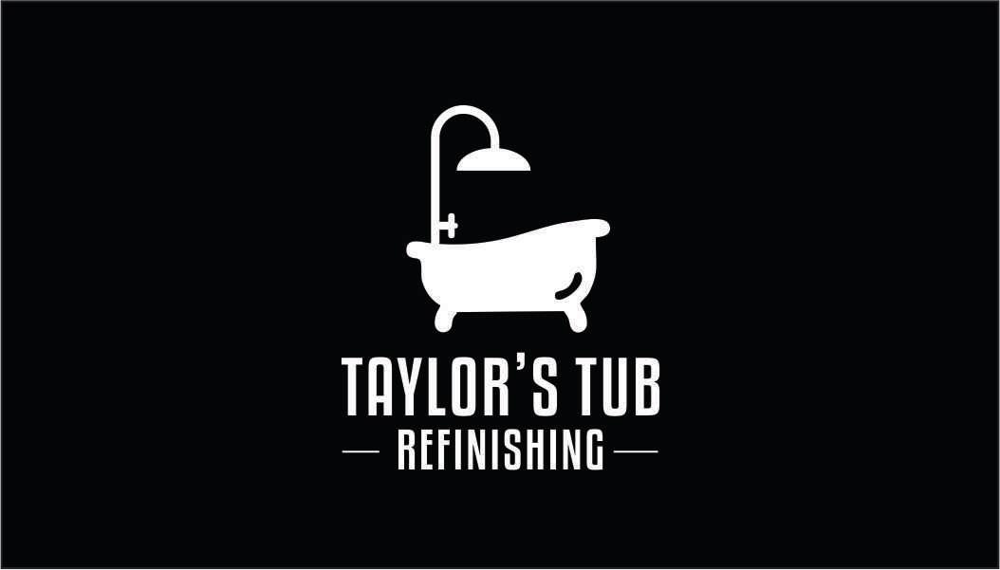
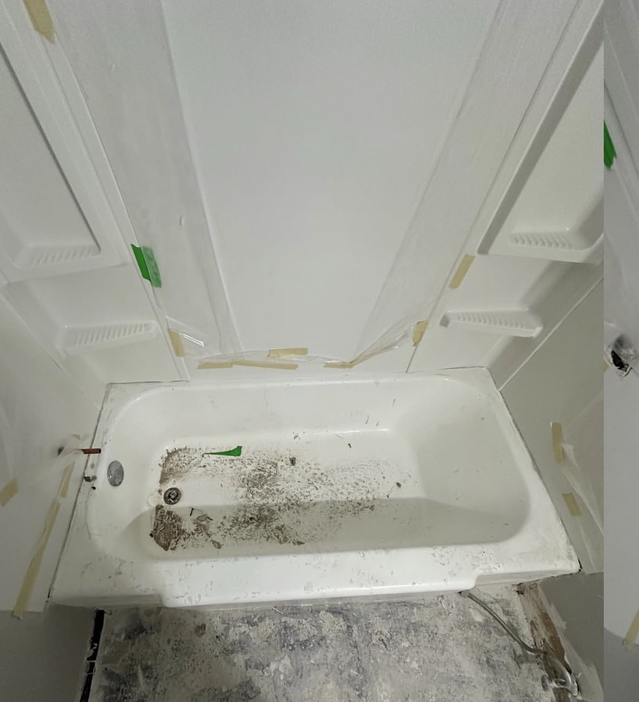
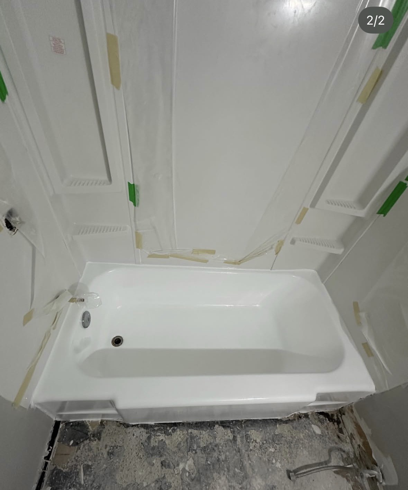
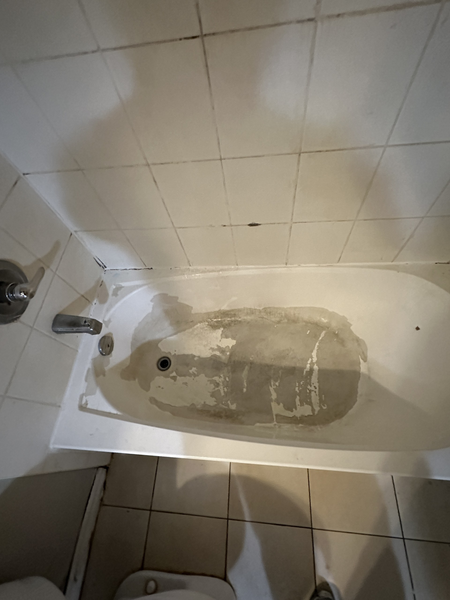
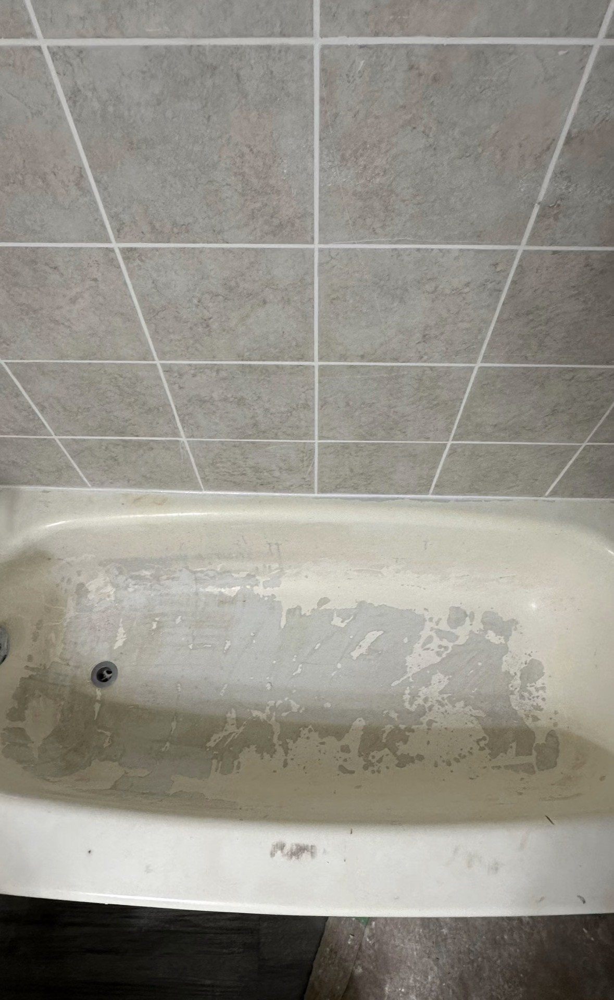
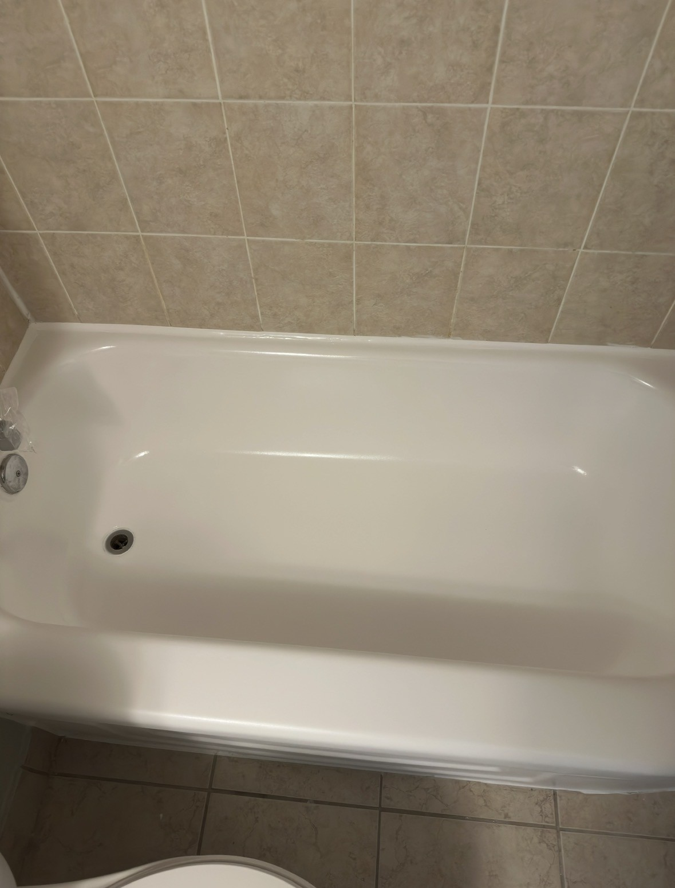

[index.html](https://github.com/user-attachments/files/28489320/index.html)
```html
<!DOCTYPE html>
<html lang="en">
<head>
<meta charset="UTF-8">
<meta name="viewport" content="width=device-width, initial-scale=1.0">

<title>Taylor's Tub Refinishing | Bathtub Reglazing St. Thomas & London Ontario</title>

<meta name="description" content="Professional bathtub reglazing, bathtub refinishing, peeling repair and tub restoration serving St. Thomas, London, Port Stanley, Aylmer, Woodstock and Southwestern Ontario.">

<style>
* {
  margin: 0;
  padding: 0;
  box-sizing: border-box;
}

html {
  scroll-behavior: smooth;
}

body {
  font-family: Arial, Helvetica, sans-serif;
  background: #f5f5f5;
  color: #222;
  line-height: 1.6;
}

header {
  background: #000;
  position: sticky;
  top: 0;
  z-index: 1000;
  padding: 14px 24px;
  box-shadow: 0 2px 12px rgba(0,0,0,.25);
}

.nav {
  max-width: 1200px;
  margin: auto;
  display: flex;
  justify-content: space-between;
  align-items: center;
}

.logo {
  height: 70px;
  width: auto;
}

.nav-links a {
  color: white;
  text-decoration: none;
  margin-left: 20px;
  font-weight: bold;
  font-size: 15px;
}

.nav-links a:hover {
  text-decoration: underline;
}

.hero {
  background:
    linear-gradient(rgba(0,0,0,.76), rgba(0,0,0,.76)),
    url("after1.jpg");
  background-size: cover;
  background-position: center;
  color: white;
  text-align: center;
  padding: 120px 20px;
}

.hero-logo {
  width: 330px;
  max-width: 90%;
  margin-bottom: 28px;
}

.hero h1 {
  font-size: 52px;
  max-width: 980px;
  margin: 0 auto 20px;
  line-height: 1.15;
}

.hero p {
  font-size: 22px;
  max-width: 820px;
  margin: 0 auto 35px;
}

.btn {
  display: inline-block;
  background: white;
  color: black;
  padding: 15px 30px;
  border-radius: 8px;
  text-decoration: none;
  font-weight: bold;
  margin: 8px;
  transition: .2s ease;
}

.btn:hover {
  transform: translateY(-2px);
}

.btn.outline {
  background: transparent;
  color: white;
  border: 2px solid white;
}

.btn.facebook {
  background: #1877F2;
  color: white;
}

.btn.instagram {
  background: #E1306C;
  color: white;
}

section {
  max-width: 1200px;
  margin: auto;
  padding: 80px 20px;
}

h2 {
  text-align: center;
  font-size: 40px;
  margin-bottom: 18px;
  line-height: 1.2;
}

.subtitle {
  text-align: center;
  max-width: 850px;
  margin: 0 auto 45px;
  font-size: 18px;
}

.services {
  display: grid;
  grid-template-columns: repeat(auto-fit, minmax(250px, 1fr));
  gap: 24px;
}

.service {
  background: white;
  padding: 30px;
  border-radius: 15px;
  box-shadow: 0 6px 22px rgba(0,0,0,.1);
}

.service h3 {
  font-size: 22px;
  margin-bottom: 10px;
}

.gallery {
  display: grid;
  gap: 42px;
}

.project {
  background: white;
  padding: 22px;
  border-radius: 16px;
  box-shadow: 0 6px 22px rgba(0,0,0,.1);
}

.photos {
  display: grid;
  grid-template-columns: 1fr 1fr;
  gap: 15px;
}

.photo {
  position: relative;
  overflow: hidden;
  border-radius: 12px;
}

.photo img {
  width: 100%;
  height: 460px;
  object-fit: cover;
  display: block;
}

.label {
  position: absolute;
  top: 14px;
  left: 14px;
  background: rgba(0,0,0,.78);
  color: white;
  padding: 8px 16px;
  border-radius: 999px;
  font-weight: bold;
}

.reviews {
  background: #111;
  color: white;
  max-width: none;
}

.reviews-inner {
  max-width: 1200px;
  margin: auto;
}

.review-grid {
  display: grid;
  grid-template-columns: repeat(auto-fit, minmax(250px, 1fr));
  gap: 24px;
}

.review {
  background: #1f1f1f;
  padding: 30px;
  border-radius: 15px;
}

.stars {
  color: #facc15;
  font-size: 26px;
  margin-bottom: 14px;
}

.area-box {
  background: white;
  padding: 32px;
  border-radius: 15px;
  text-align: center;
  box-shadow: 0 6px 22px rgba(0,0,0,.1);
  font-size: 18px;
}

.contact {
  background: #000;
  color: white;
  max-width: none;
  text-align: center;
}

.contact-inner {
  max-width: 900px;
  margin: auto;
}

.contact p {
  font-size: 20px;
  margin-bottom: 30px;
}

footer {
  background: #000;
  color: white;
  text-align: center;
  padding: 30px 20px;
  font-size: 14px;
}

@media(max-width: 768px) {
  .nav {
    flex-direction: column;
  }

  .nav-links {
    margin-top: 12px;
    text-align: center;
  }

  .nav-links a {
    display: inline-block;
    margin: 6px 8px;
  }

  .hero {
    padding: 80px 20px;
  }

  .hero h1 {
    font-size: 35px;
  }

  .hero p {
    font-size: 18px;
  }

  h2 {
    font-size: 31px;
  }

  .photos {
    grid-template-columns: 1fr;
  }

  .photo img {
    height: auto;
  }
}
</style>
</head>

<body>

<header>
  <div class="nav">
    

    <div class="nav-links">
      <a href="#services">Services</a>
      <a href="#gallery">Before & After</a>
      <a href="#reviews">Reviews</a>
      <a href="#contact">Contact</a>
    </div>
  </div>
</header>

<section class="hero">
  

  <h1>Bathtub Reglazing & Refinishing That Makes Old Tubs Look New Again</h1>

  <p>
    Peeling coatings, stains, water damage and worn finishes professionally restored with a clean, glossy finish — without the cost and mess of replacement.
  </p>

  <a href="tel:5198541809" class="btn">Call 519-854-1809</a>
  <a href="https://www.facebook.com/TaylorsTubRefinishing" target="_blank" class="btn outline">Message on Facebook</a>
</section>

<section id="services">
  <h2>Professional Bathtub Refinishing</h2>

  <p class="subtitle">
    Taylor's Tub Refinishing helps homeowners, landlords, contractors and property managers restore worn bathtubs throughout Southwestern Ontario.
  </p>

  <div class="services">
    <div class="service">
      <h3>Bathtub Reglazing</h3>
      <p>Restore your existing bathtub with a fresh, glossy, professional finish.</p>
    </div>

    <div class="service">
      <h3>Bathtub Refinishing</h3>
      <p>Perfect for tubs that are dull, stained, scratched, outdated or showing years of wear.</p>
    </div>

    <div class="service">
      <h3>Peeling & Damage Repair</h3>
      <p>Repair peeling coatings, chips, surface wear and problem areas before refinishing.</p>
    </div>

    <div class="service">
      <h3>Rental Turnovers</h3>
      <p>Reliable refinishing for apartments, rental units, landlords and property managers.</p>
    </div>
  </div>
</section>

<section id="gallery">
  <h2>Real Before & After Transformations</h2>

  <p class="subtitle">
    Actual bathtub reglazing and refinishing projects completed by Taylor's Tub Refinishing.
  </p>

  <div class="gallery">

    <div class="project">
      <div class="photos">
        <div class="photo">
          <span class="label">Before</span>
          
        </div>

        <div class="photo">
          <span class="label">After</span>
          
        </div>
      </div>
    </div>

    <div class="project">
      <div class="photos">
        <div class="photo">
          <span class="label">Before</span>
          
        </div>

        <div class="photo">
          <span class="label">After</span>
          
        </div>
      </div>
    </div>

    <div class="project">
      <div class="photos">
        <div class="photo">
          <span class="label">Before</span>
          
        </div>

        <div class="photo">
          <span class="label">After</span>
          
        </div>
      </div>
    </div>

  </div>
</section>

<section id="reviews" class="reviews">
  <div class="reviews-inner">
    <h2>What Customers Are Saying</h2>

    <p class="subtitle">
      Proud to provide clean, professional bathtub refinishing with results customers can see.
    </p>

    <div class="review-grid">
      <div class="review">
        <div class="stars">★★★★★</div>
        <p>Excellent service. Answered all my questions. Very pleased with the outcome!</p>
      </div>

      <div class="review">
        <div class="stars">★★★★★</div>
        <p>Josh does excellent work and is quick to respond and schedule. Looking forward to future work.</p>
      </div>

      <div class="review">
        <div class="stars">★★★★★</div>
        <p>The bathtub looked brand new. Great communication and great results.</p>
      </div>
    </div>
  </div>
</section>

<section>
  <h2>Areas We Serve</h2>

  <div class="area-box">
    <p>
      Taylor's Tub Refinishing proudly serves <strong>St. Thomas, London, Port Stanley, Aylmer, Woodstock, Tillsonburg, Ingersoll, Dorchester, Belmont, Sarnia</strong> and surrounding Southwestern Ontario communities.
    </p>
  </div>
</section>

<section id="contact" class="contact">
  <div class="contact-inner">
    <h2>Ready For A Fresh, Glossy Tub?</h2>

    <p>
      Call, message, or connect with Taylor's Tub Refinishing today. For the fastest estimate, send a few clear photos of your bathtub.
    </p>

    <a href="tel:5198541809" class="btn">📞 Call 519-854-1809</a>
    <a href="https://www.facebook.com/TaylorsTubRefinishing" target="_blank" class="btn facebook">Facebook</a>
    <a href="https://www.instagram.com/taylorstubrefinishing" target="_blank" class="btn instagram">Instagram</a>
  </div>
</section>

<footer>
  <p>© 2026 Taylor's Tub Refinishing Inc.</p>
  <p>Bathtub Reglazing • Bathtub Refinishing • Tub Restoration • St. Thomas & London Ontario</p>
</footer>

</body>
</html>
```
